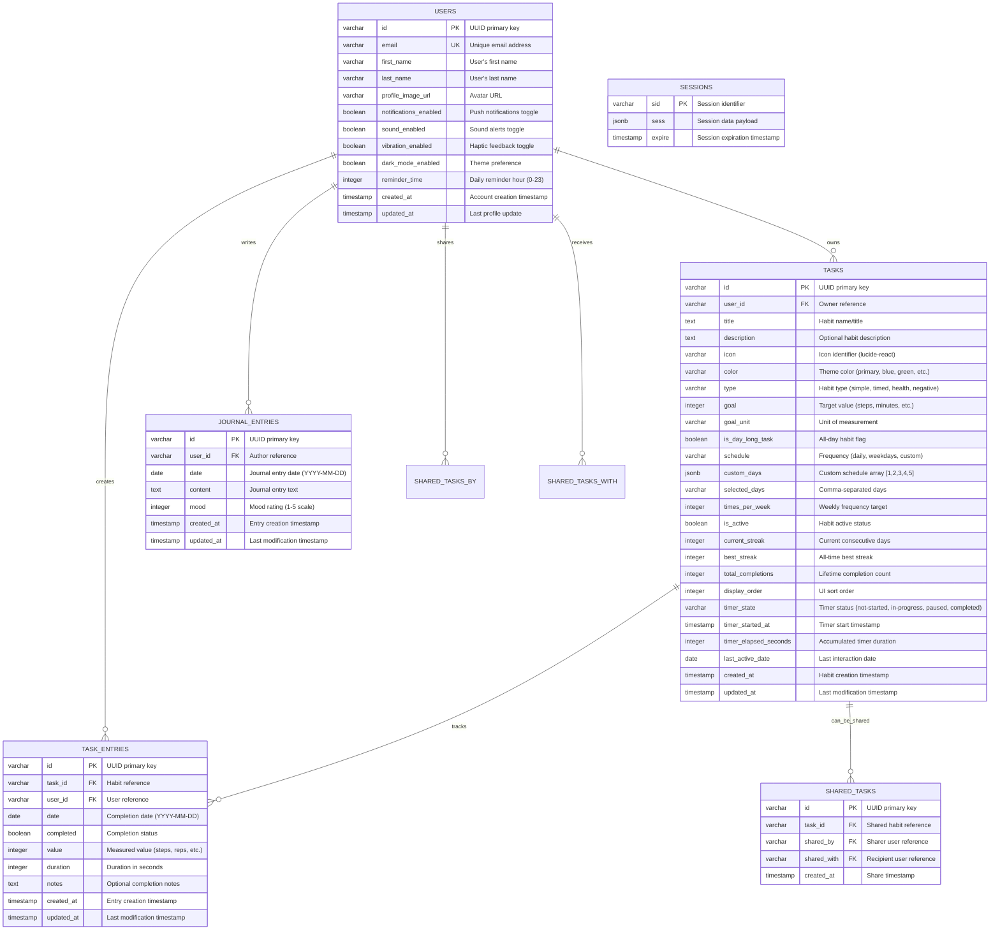

# Momentum

> Build lasting habits, track your progress

## Project Summary

Momentum is a Progressive Web App (PWA) habit tracker. The application allows users to create, manage, and track daily habits with comprehensive progress visualization, streak tracking, and social sharing features. Built as a full-stack web application with modern technologies, it provides offline functionality and cross-platform compatibility through PWA standards.

The application features real-time habit tracking with timer persistence, drag-and-drop reordering, comprehensive statistics, journal functionality, and a complete dark/light theme system. Users can create custom habits with flexible scheduling, track progress with visual indicators, and maintain accountability through streak tracking and progress visualization.

## Technology Stack

### Frontend Technologies
- **React 18** with TypeScript for type-safe component development
- **Vite** as the build tool with hot module replacement for fast development
- **Tailwind CSS** for utility-first responsive styling with custom design tokens
- **Shadcn/ui** component library built on Radix UI primitives for accessibility
- **TanStack Query (React Query)** for server state management and intelligent caching
- **Wouter** for lightweight client-side routing
- **@dnd-kit** for modern drag-and-drop with cross-platform touch/mouse support
- **Framer Motion** for smooth animations and transitions
- **React Hook Form** with Zod validation for type-safe form handling
- **Date-fns** for comprehensive date manipulation and formatting

### Backend Technologies
- **Node.js** runtime with Express.js web framework
- **TypeScript** with strict type checking for server-side development
- **PostgreSQL** database with Neon serverless hosting for scalability
- **Drizzle ORM** for type-safe database operations and query building
- **Passport.js** with OpenID Connect for authentication middleware
- **Express Sessions** with PostgreSQL store for secure session management
- **Connect PG Simple** for PostgreSQL-backed session storage

### Development & Build Tools
- **ESBuild** for fast JavaScript bundling and transpilation
- **PostCSS** with Tailwind CSS and Autoprefixer for CSS processing
- **Drizzle Kit** for database schema management and migrations
- **TypeScript Compiler** for static type checking across the codebase

### Authentication & Security
- **Replit OIDC** integration for secure user authentication
- **OpenID Client** for OIDC protocol implementation
- **HTTP-only cookies** with 7-day TTL for secure session management
- **CSRF protection** and secure session configuration

### Deployment & Infrastructure
- **Replit Deployments** for production hosting with autoscale capabilities
- **Neon Database** for serverless PostgreSQL with connection pooling
- **Service Worker** for PWA functionality and offline data persistence
- **Web App Manifest** for cross-platform installability

## Architecture Overview

### Application Architecture

Momentum follows a modern full-stack architecture with clear separation of concerns:

#### **Client-Server Architecture**
- **Single-page Application (SPA)** frontend built with React
- **RESTful API** backend providing JSON endpoints
- **Real-time synchronization** between client and server state
- **Offline-first design** with service worker caching

#### **Data Flow Architecture**
```
User Interface (React Components)
    ↓
TanStack Query (State Management)
    ↓
HTTP Requests (Fetch API)
    ↓
Express.js API Routes
    ↓
Drizzle ORM (Database Layer)
    ↓
PostgreSQL Database
```

#### **Authentication Flow**
```
Landing Page → Replit OIDC → User Session → Protected Routes
```

### Frontend Architecture

#### **Component Architecture**
- **Atomic Design Pattern**: Components organized from atoms to organisms
- **Composition over Inheritance**: Leveraging React's component composition
- **Custom Hooks**: Shared logic extracted into reusable hooks
- **Context Providers**: Global state management for themes and user data

#### **State Management Strategy**
- **Server State**: TanStack Query for API data caching and synchronization
- **Client State**: React useState and useReducer for local component state
- **Global State**: React Context for themes and user preferences
- **Persistent State**: localStorage for offline data and user preferences

#### **Routing Structure**
```
/                    # Landing page (unauthenticated)
/home               # Main habit dashboard
/statistics         # Progress analytics and charts
/journal            # Daily reflection and notes
/profile            # User settings and preferences
/settings           # Application configuration
```

#### **Theme System Architecture**
- **CSS Variables**: Dynamic color system with light/dark variants
- **ThemeContext**: React context provider for theme state management
- **localStorage**: Persistent theme preference storage
- **System Integration**: Automatic detection of user's system color scheme

### Backend Architecture

#### **Server Architecture**
- **Express.js Middleware Pipeline**: Request/response processing chain
- **Route-based Organization**: API endpoints organized by feature domain
- **Error Handling Middleware**: Centralized error processing and logging
- **Session Management**: PostgreSQL-backed session storage

#### **API Design Patterns**
- **RESTful Endpoints**: Standard HTTP methods and status codes
- **Resource-based URLs**: `/api/tasks`, `/api/journal`, `/api/statistics`
- **Request Validation**: Zod schemas for type-safe input validation
- **Response Standardization**: Consistent JSON response formats

#### **Database Architecture**
- **Drizzle ORM**: Type-safe database operations with automatic type inference
- **Schema Definition**: Centralized schema in `shared/schema.ts`
- **Migration Management**: Drizzle Kit for schema versioning
- **Connection Pooling**: Efficient database connection management

### Security Architecture

#### **Authentication & Authorization**
- **OIDC Integration**: Secure authentication through Replit's OpenID Connect
- **Session-based Auth**: Server-side session management with secure cookies
- **Route Protection**: Middleware-based authorization for protected endpoints
- **CSRF Protection**: Built-in protection against cross-site request forgery

#### **Data Security**
- **Input Validation**: Zod schemas for runtime type checking
- **SQL Injection Prevention**: Parameterized queries through Drizzle ORM
- **Environment Variables**: Secure configuration management
- **HTTPS Enforcement**: Secure communication in production

## Detailed Project Structure

```
momentum/
├── client/                           # Frontend React application
│   ├── public/                       # Static assets and PWA manifest
│   │   ├── manifest.json            # PWA configuration
│   │   └── sw.js                    # Service worker for offline functionality
│   ├── src/
│   │   ├── components/              # React components
│   │   │   ├── ui/                  # Base UI components (Shadcn/ui)
│   │   │   │   ├── card.tsx         # Card component variants
│   │   │   │   ├── button.tsx       # Button component with variants
│   │   │   │   ├── dialog.tsx       # Modal dialog components
│   │   │   │   ├── form.tsx         # Form components with validation
│   │   │   │   └── ...              # Other base UI components
│   │   │   ├── AddTaskModal.tsx     # Habit creation modal
│   │   │   ├── TaskCard.tsx         # Individual habit card component
│   │   │   ├── TaskConfigModal.tsx  # Habit configuration modal
│   │   │   ├── ThemeToggle.tsx      # Theme switching component
│   │   │   └── BottomNavigation.tsx # Mobile navigation component
│   │   ├── pages/                   # Application pages/routes
│   │   │   ├── Landing.tsx          # Unauthenticated landing page
│   │   │   ├── Home.tsx             # Main habit dashboard
│   │   │   ├── Statistics.tsx       # Progress analytics page
│   │   │   ├── Journal.tsx          # Daily reflection page
│   │   │   ├── Profile.tsx          # User profile and settings
│   │   │   └── Settings.tsx         # Application settings
│   │   ├── lib/                     # Utilities and configurations
│   │   │   ├── queryClient.ts       # TanStack Query configuration
│   │   │   ├── utils.ts             # Utility functions
│   │   │   └── validations.ts       # Form validation schemas
│   │   ├── hooks/                   # Custom React hooks
│   │   │   ├── use-toast.ts         # Toast notification hook
│   │   │   └── use-theme.ts         # Theme management hook
│   │   ├── contexts/                # React context providers
│   │   │   └── ThemeContext.tsx     # Global theme state management
│   │   ├── main.tsx                 # Application entry point
│   │   ├── App.tsx                  # Root component with routing
│   │   └── index.css                # Global styles and CSS variables
│   └── index.html                   # HTML template
├── server/                          # Backend Express application
│   ├── routes.ts                    # API endpoint definitions
│   │   ├── Authentication routes    # /api/auth/* endpoints
│   │   ├── Task management routes   # /api/tasks/* endpoints
│   │   ├── Journal routes          # /api/journal/* endpoints
│   │   ├── Statistics routes       # /api/statistics/* endpoints
│   │   └── User preference routes  # /api/user/* endpoints
│   ├── storage.ts                   # Database operations and queries
│   │   ├── IStorage interface      # Storage abstraction layer
│   │   ├── PostgreSQL implementation # Production database operations
│   │   └── CRUD operations         # Create, Read, Update, Delete functions
│   ├── vite.ts                      # Vite development server integration
│   ├── static.ts                    # Static file serving for production
│   └── index.ts                     # Server entry point and configuration
├── shared/                          # Shared types and schemas
│   └── schema.ts                    # Database schema definitions
│       ├── Users table schema      # User profile and authentication
│       ├── Tasks table schema      # Habit definitions and configuration
│       ├── TaskEntries schema      # Daily progress tracking
│       ├── JournalEntries schema   # Daily reflection entries
│       ├── Sessions schema         # User session management
│       ├── Zod validation schemas  # Runtime type validation
│       └── TypeScript type exports # Shared type definitions
├── dist/                           # Production build output
│   ├── public/                     # Built client assets
│   │   ├── assets/                 # Bundled CSS/JS files
│   │   ├── index.html              # Built HTML template
│   │   └── manifest.json           # PWA manifest
│   └── index.js                    # Built server bundle
├── package.json                    # Dependencies and scripts
├── vite.config.ts                  # Vite build configuration
├── tailwind.config.ts              # Tailwind CSS configuration
├── drizzle.config.ts               # Database configuration
├── tsconfig.json                   # TypeScript configuration
└── replit.md                       # Project documentation and preferences
```

### Key Architectural Decisions

#### **Database Schema Design**
- **Normalized Structure**: Separate tables for users, tasks, entries, and sessions
- **Type Safety**: Drizzle ORM provides compile-time type checking
- **Flexible Scheduling**: JSON fields for complex habit scheduling rules
- **Audit Trail**: Timestamp fields for tracking creation and updates

#### **State Management Strategy**
- **Server State**: TanStack Query handles all API interactions with intelligent caching
- **Optimistic Updates**: Immediate UI updates with server reconciliation
- **Error Boundaries**: Graceful error handling with user-friendly fallbacks
- **Cache Invalidation**: Strategic cache updates for real-time data consistency

#### **Performance Optimizations**
- **Code Splitting**: Lazy loading of routes for faster initial load
- **Asset Optimization**: Vite's built-in optimization for production builds
- **Database Indexing**: Optimized queries for user and date-based lookups
- **Service Worker**: Aggressive caching for offline functionality

#### **Responsive Design Strategy**
- **Mobile-First**: Primary development focus on mobile experience
- **Progressive Enhancement**: Desktop features built on mobile foundation
- **Touch Interactions**: Native touch support for drag-and-drop and gestures
- **Adaptive UI**: Components that adapt to screen size and input method

This architecture provides a scalable, maintainable, and performant foundation for the Momentum habit tracking application, with clear separation of concerns and modern development practices throughout.

## Database Schema

### Entity Relationship Diagram



### Table Descriptions

#### **Users Table**
The central user management table storing authentication data, profile information, and application preferences.

**Key Features:**
- UUID-based primary keys for security and scalability
- Comprehensive user preference storage (notifications, theme, reminders)
- Profile information with optional avatar support
- Created/updated timestamps for audit trails

**Relationships:**
- One-to-many with Tasks (user owns multiple habits)
- One-to-many with TaskEntries (user creates multiple completions)
- One-to-many with JournalEntries (user writes multiple journal entries)
- Many-to-many with SharedTasks (users can share and receive habits)

#### **Tasks Table**
Core habit definition table with comprehensive configuration options and real-time state management.

**Key Features:**
- Flexible habit types: simple completion, timed activities, health metrics, negative habits
- Advanced scheduling: daily, weekdays, custom patterns, weekly frequency targets
- Real-time timer state persistence across sessions and devices
- Comprehensive progress tracking: current streak, best streak, total completions
- Drag-and-drop ordering support with display_order field
- Visual customization: icons, colors, descriptions

**Business Logic:**
- Timer state machine: not-started → in-progress → paused → completed
- Daily timer reset logic using last_active_date comparison
- Streak calculation based on consecutive TaskEntry completions
- Goal tracking with flexible units (steps, minutes, calories, etc.)

#### **Task Entries Table**
Daily completion records linking users and habits with detailed tracking data.

**Key Features:**
- Unique constraint: one entry per user/task/date combination
- Flexible value storage for measurable habits (steps, duration, reps)
- Optional notes for completion context
- Boolean completion status for simple habits
- Duration tracking for timed activities

**Data Integrity:**
- Composite unique constraint prevents duplicate daily entries
- Foreign key constraints ensure referential integrity
- Date-based partitioning ready for performance optimization

#### **Journal Entries Table**
Daily reflection and mood tracking system for personal development insights.

**Key Features:**
- One entry per user per day (enforced by unique constraint)
- Rich text content support for detailed reflections
- Mood tracking on 1-5 scale for emotional pattern analysis
- Date-based organization for timeline views

**Analytics Support:**
- Mood trend analysis over time
- Correlation with habit completion patterns
- Content analysis for personal insights

#### **Shared Tasks Table**
Social features enabling habit sharing and accountability partnerships.

**Key Features:**
- Many-to-many relationship between users through shared habits
- Tracks sharing origin and destination
- Timestamp for sharing analytics
- Supports accountability partner features

**Future Extensions:**
- Sharing permissions and visibility controls
- Collaborative goal setting
- Social progress sharing

#### **Sessions Table**
Secure session management with PostgreSQL storage for scalability and persistence.

**Key Features:**
- Standard Express session structure
- JSONB storage for flexible session data
- Automatic expiration handling
- Index on expire column for cleanup performance

### Database Indexes and Performance

#### **Optimized Queries:**
- User-based habit lookups: `tasks.user_id`
- Date-range entry queries: `task_entries.date`
- Session expiration cleanup: `sessions.expire`
- Task ordering: `tasks.display_order`

#### **Composite Indexes:**
- Task entries uniqueness: `(task_id, user_id, date)`
- Journal entries uniqueness: `(user_id, date)`
- User task lookup: `(user_id, is_active, display_order)`

### Data Validation and Types

#### **Drizzle ORM Integration:**
- Compile-time type safety with TypeScript
- Runtime validation with Zod schemas
- Automatic type inference for API responses
- Schema-driven form validation

#### **Key Validation Rules:**
```typescript
// Task creation validation
export const insertTaskSchema = createInsertSchema(tasks).omit({
    id: true,
    userId: true,
    currentStreak: true,
    bestStreak: true,
    totalCompletions: true,
    createdAt: true,
    updatedAt: true,
}).extend({
    isDayLongTask: z.boolean().optional(),
    selectedDays: z.string().optional(),
});

// Task entry validation
export const insertTaskEntrySchema = createInsertSchema(taskEntries).omit({
    id: true,
    userId: true,
    createdAt: true,
    updatedAt: true,
});
```

### Migration Strategy

#### **Schema Evolution:**
- Drizzle Kit for automated migration generation
- Forward-only migrations for data safety
- Rollback strategies for critical updates
- Zero-downtime deployment support

#### **Data Migration Patterns:**
- Additive changes preferred (new columns with defaults)
- Careful handling of NOT NULL constraints
- Batch updates for large datasets
- Validation scripts for data integrity

This comprehensive database design supports the full feature set of the Momentum habit tracking application while maintaining performance, scalability, and data integrity.